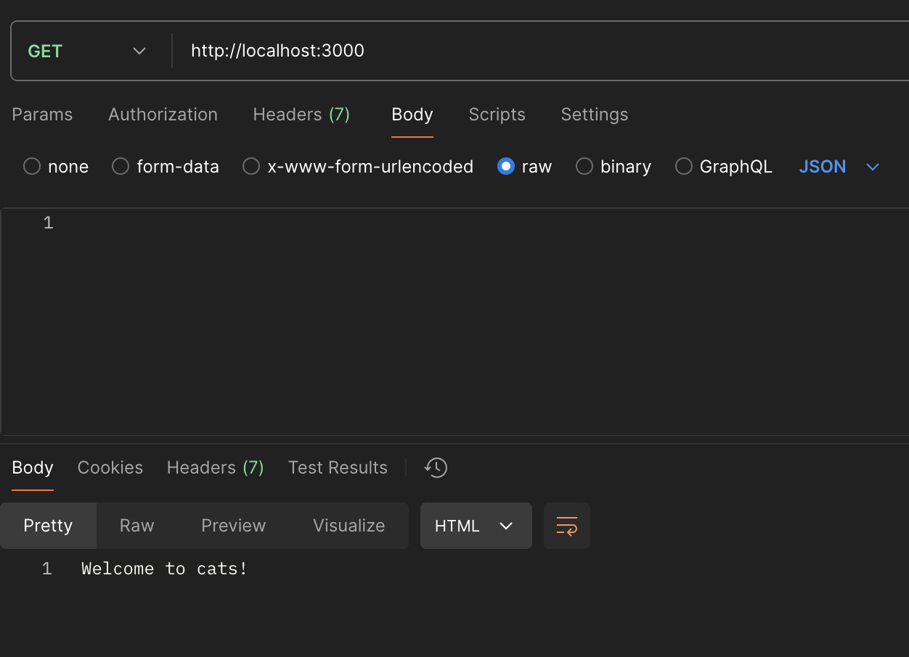
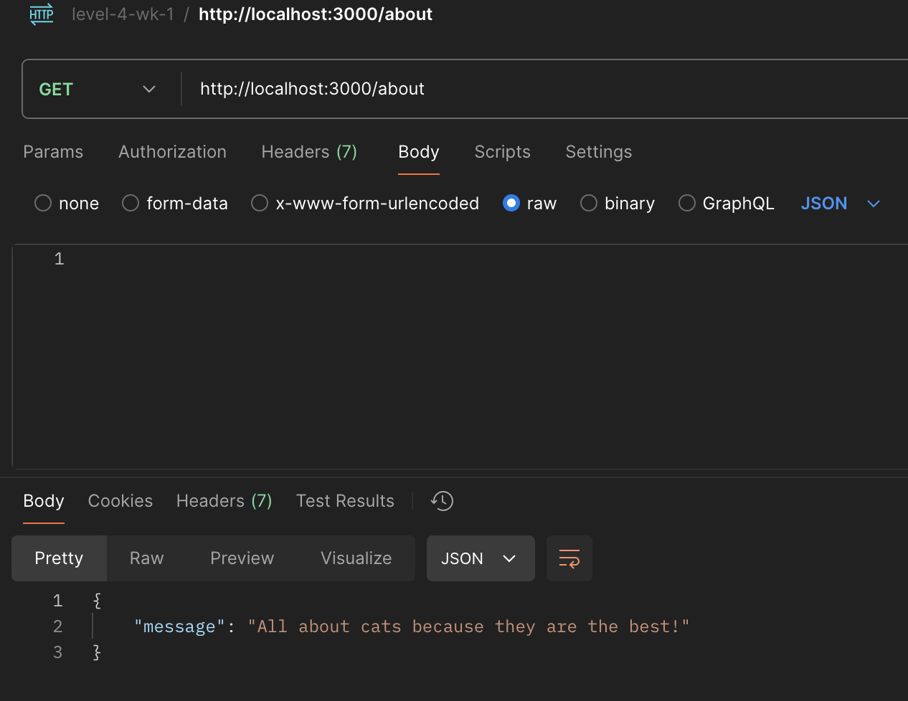
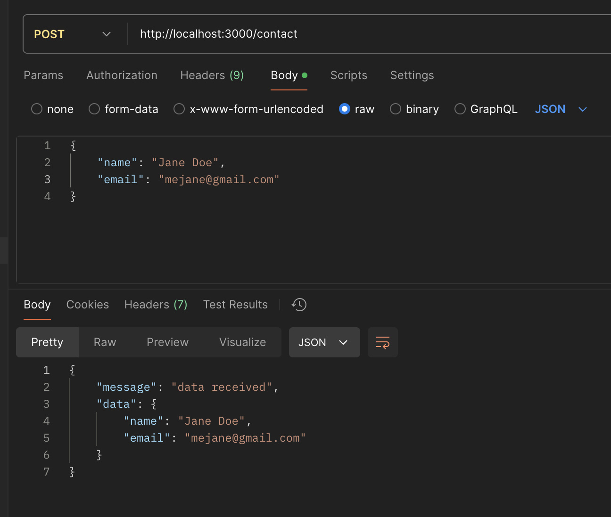
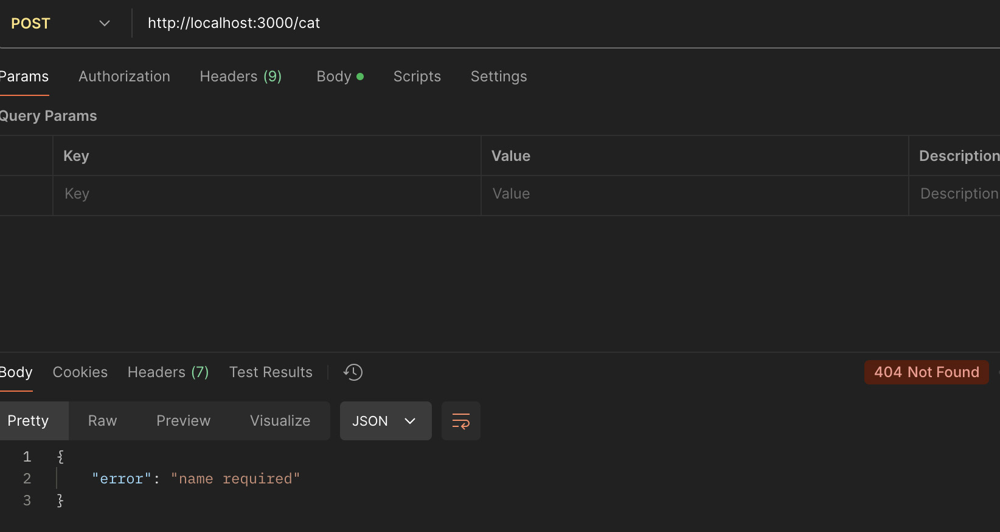
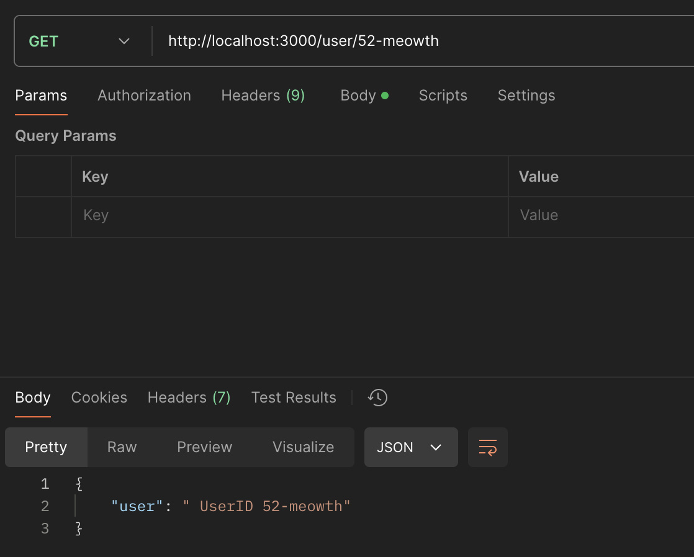
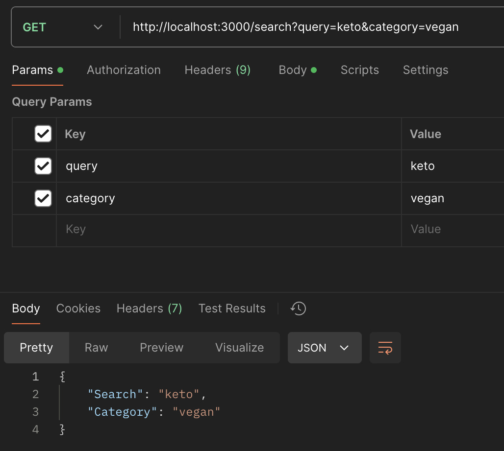

# express-http-methods

## **Objective**
Understand and implement basic HTTP methods (GET and POST) in an Express application. Handle URL and query parameters in Express routes, and practice sending and receiving JSON data.

## **Part 1: Create and Clone Your GitHub Repository**
- [x] Create a New GitHub Repository:
- [x] Name your repository express-http-methods.
- [x] Initialize it with a .gitignore for Node.js and a README.md.
- [x] Clone Your Repository:

## **Part 2: Setup and Configuration**

- [x] Within your project directory, run npm init -y to generate necessary files.
- [x] Install Dependencies:
- [x] Add the necessary dependencies with npm install express.

## **Part 3: Implement Routes for GET and POST Requests**
- [x] Setup Basic Routing:
- [x] Create a new file named index.js.
- [x] Set up routes to handle GET and POST requests.
- [x] Middleware:
- [x] Include middleware to parse JSON bodies.
- [x] Create Routes:
- [x] Use Postman to test the routes.

## Implement routes to handle the following:
- [x] A GET request to the root (/) that responds with a welcome message.

- [x] A GET request to /about that responds with a JSON message.

- [x] A POST request to /contact that responds with the submitted data.
- [x] POST /contact: Send a JSON body with name and email

- [x] Ensure there is a catch-all route for undefined routes that returns a 404 status code.

## **Part 4: Handle URL and Query Parameters**
- [x] URL Parameters:
- [x] Add a route to handle URL parameters for /user/:id.
Query Parameters:
- [x] GET /user/:id: Replace :id with a sample user ID.

- [x] Add a route to handle query parameters for /search.
- [x] GET /search: Include query parameters term and sort

